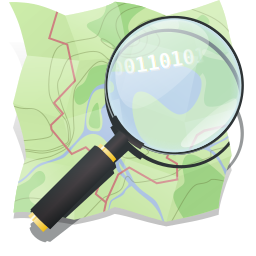

# Awesome OpenStreetMap 

> A curated list of awesome [OpenStreetMap](https://www.openstreetmap.org)-projects.

OpenStreetMap is an open map being used by millions of devices and
users every day. It can both be edited and used by anyone free of charge.

This list contains projects using OpenStreetMap data for creative purposes, as well as projects dedicated
to improving OpenStreetMap.

## Contents

* [Editors](#editors)
* [Web Apps](#web-apps)
  * [Task-Managers](#task-managers)
  * [Live-Viewers](#live-viewers)
* [Mobile Apps](#mobile-apps)
  * [Android Apps](#android-apps)
  * [iOS Apps](#ios-apps)
* [Public APIs](#public-apis)
* [Tools](#tools)
* [Libraries](#libraries)
  * [C/C++](#cc)
  * [JavaScript](#javascript)
  * [Python](#python)
  * [Java](#java)
* [Maps](#maps)
  * [Generators](#generators)
  * [Map-Styles](#map-styles)
* [Video](#video)
  * [Global](#global)
  * [Regional](#regional)
* [Additional Ressources](#additional-ressources)
  * [Websites](#websites)
  * [Wiki-Pages](#wiki-pages)
* [Articles](#articles)
* [Communities](#communities)
  * [Global Communities](#global-communities)

## Editors

* [iD](http://www.openstreetmap.org/edit?editor=id) - JavaScript based editor for the web browser with a wide array of presets. ([Source Code](https://github.com/openstreetmap/iD))
* [Potlatch](https://www.openstreetmap.org/edit?editor=potlatch2) - Flash based editor for the web browser. ([Source Code](https://git.openstreetmap.org/potlatch2.git))
* [JOSM](https://josm.openstreetmap.de) - Advanced extensible desktop editor. ([Source Code](https://josm.openstreetmap.de/browser))
* [Level0](http://level0.osmz.ru/) - Text based editor that's useful in specific corner cases. ([Source Code](https://github.com/zverik/level0))

## Web Apps

* [overpass-turbo](http://overpass-turbo.eu) - Web based data mining tool for OpenStreetMap using Overpass API. ([Source Code](https://github.com/tyrasd/overpass-turbo))
* [osmcha](https://osmcha.mapbox.com) - Detector for suspicious changesets. ([Source Code](https://github.com/mapbox/osmcha-frontend))
* [hdyc](http://hdyc.neis-one.org) - Statistics viewer for contributions of any OSM user.
<!--Offline, may be because of russia-ukraine-war - * [whodidit](http://zverik.osm.rambler.ru/whodidit/) - Changesets analyzer.-->
* [achavi](https://overpass-api.de/achavi/) - Augmented change viewer. ([Source Code](https://github.com/nrenner/achavi/))
* [changeset-map](http://osmlab.github.io/changeset-map/) - Map visualizing changesets. ([Source Code](https://github.com/osmlab/changeset-map))
* [last-week-on-osm](https://tyrasd.github.io/latest-changes/#2/15.0/-15.0) - Map for exploring latest changesets. ([Source Code](https://github.com/tyrasd/latest-changes/))
* [Analytic OSM Tracker](https://github.com/MichaelVL/osm-analytic-tracker) - Tracker for changesets in your region.
* [MapWith.ai](https://mapwith.ai/) - AI assisted versions of iD. ([Meta-Repo](https://github.com/facebookmicrosites/Open-Mapping-At-Facebook) / [Editor Source Code](https://github.com/facebookincubator/RapiD))
* [Osmose](https://osmose.openstreetmap.fr) - QA-tool for fixing problems detected in OpenStreetMap data. ([Source Code](https://github.com/osm-fr?q=osmose))
* [opening_hours evaluation tool](https://openingh.openstreetmap.de/evaluation_tool/) - Tool for evaluating `opening_hours` tags. ([Source Code](https://github.com/opening-hours/opening_hours.js))
* [taginfo](https://taginfo.openstreetmap.org/) - Website displaying information on tags and their usage. ([Source Code](https://github.com/taginfo/taginfo/))
* [Turn Restrictions](https://ahorn.lima-city.de/tr/) - Viewer for turn-restrictions and linked errors.
* [NLMaps](https://nlmaps.gorgor.de/) - Website allowing to query OSM data using plain English.
* [My Notes](https://my-notes.osm-hr.org/) - Search for finding your old unresolved notes.
* [OSMyBiz](https://osmybiz.osm.ch) - Website for managing informations about your business. ([Source Code](https://gitlab.com/geometalab/osmybiz))
* [Baato Before-After Maps](https://beforeafter.baato.io/) - Generate before-after maps to visualize the work your local community has done. ([Source Code](https://github.com/baato/before-after))
* [YoHours](https://projets.pavie.info/yohours/) - Tool for generating `opening_hours` tags. ([Source Code](https://framagit.org/PanierAvide/YoHours))
* [OpenStreetMap Welcome Tool](https://welcome.osm.be/) - Tool for finding fresh mappers in your area. ([Source Code](https://github.com/osmbe/osm-welcome-tool))
* [Web To OSM Opening Hours](https://webmapping.cyou/WebToOSMOH/) - Tool for converting human-readable opening hours to `opening_hours` tags. ([Source Code](https://github.com/OSM-de/WebToOSMOH))
* [ohsome Dashboard](https://ohsome.org/apps/dashboard/) - Tool for visualizing changes over a certain time period.

### Task-Managers

* [HOT Tasking Manager](https://tasks.hotosm.org/) - Mapping tasks for supporting humanitarian missions in crisis areas.
* [MapRoulette](https://maproulette.org/) - Various challenges for making small edits to achive big tasks. ([Source Code](https://github.com/osmlab/maproulette3))
* [Pic4Review](https://pic4review.pavie.info/#/) - Tool for adding objects to OSM by reviewing images. ([Source Code](https://framagit.org/Pic4Carto/Pic4Review))
* [Map Complete](https://mapcomplete.osm.be/) - Tool for mapping in scoped tasks.
* [Damn Project](https://www.damn-project.org/) - Project for mapping by dividing big areas into small squares mappable by humans. ([Source Code](https://git.sr.ht/~qeef/damn-deploy))
* [NotesReview](https://ent8r.github.io/NotesReview/) - Interface for searching and resolving OSM notes. ([Source Code](https://github.com/ENT8R/NotesReview))

### Live-Viewers

* [Show me the way](https://osmlab.github.io/show-me-the-way/) - Live map showing latest changes on aerial imagery. ([Source Code](https://github.com/osmlab/show-me-the-way/))
* [OSM In Realtime](https://osm-in-realtime.jwestman.net/) - Visualization of the changes made to OpenStreetMap as they happen. ([Source Code](https://gitlab.com/jwestman/osm-in-realtime))

## Mobile Apps

* [OsmAnd](https://osmand.net) - Map viewing and navigation (routing) application with offline functionality available for Android and iOS. ([Source Code Android](https://github.com/osmandapp/OsmAnd) / [Source Code iOS](https://github.com/osmandapp/OsmAnd-iOS))

### Android Apps

* [StreetComplete](https://github.com/westnordost/StreetComplete) - App for improving OSM by answering simple questions.
* [OSMTracker](https://github.com/labexp/osmtracker-android) - Offline GPS tracking tool for recording GPX tracks.

### iOS Apps

## Public APIs

* [overpass](http://overpass-api.de) - Read-only API that serves up custom selected parts of the OSM map data. ([Source Code](https://github.com/drolbr/Overpass-API))
* [osm.mazdermind](https://osm.mazdermind.de/replicate-sequences/) - Maps Timestamp to replicate sequences. ([Source Code](https://github.com/MaZderMind/replicate-sequences))
* [planet.osm](http://planet.osm.org) - Minutely/weekly/yearly/full dumps of osm data.
* [bbbike](https://extract.bbbike.org) - Custom extracts of areas from planet.osm.

## Tools

* [OpenMapTiles](https://openmaptiles.org/) - Set of tools for self-hosted vector maps and map services with labels in more than 50 languages. ([Source Code](https://github.com/openmaptiles))
* [OSMNames](http://osmnames.org/) - Geocoding tool ranking places according to the corresponding Wikipedia page popularity. ([Source Code](https://github.com/osmnames/osmnames))
* [Baremaps](https://www.baremaps.com/) - Open source pipeline for producing Mapbox vector tiles from OpenStreetMap with Postgis and Java. ([Source Code](https://github.com/baremaps/baremaps))

## Libraries

### C/C++

* [libosmium](https://github.com/osmcode/libosmium) - Fast and flexible C++ library for working with OpenStreetMap data.
* [OSRM](https://github.com/Project-OSRM/osrm-backend) -  Routing engine for use in C++ applications.

### JavaScript

* [openstreetmap-tag-map](https://github.com/tanrax/openstreetmap-tag-map) - Tag for Riot.js to generate iframe-map from the country and region.
* [node-osmium](https://github.com/osmcode/node-osmium) - Node wrapper for libosmium for working with OpenStreetMap data.

### Python

* [overpass-wrapper](https://github.com/mvexel/overpass-api-python-wrapper) - Wrapper around the OpenStreetMap Overpass API.
* [osmapi](https://github.com/metaodi/osmapi) - Python wrapper for the OpenStreetMap API.
* [osmcha](https://github.com/willemarcel/osmcha) - Python package to detect suspicious OSM changesets.
* [osmnx](https://github.com/gboeing/osmnx) - Visualizer for street networks.

### Java

* [OpenTripPlanner](https://github.com/opentripplanner/OpenTripPlanner) - Open source multi-modal trip planner.
* [GraphHopper](https://github.com/graphhopper/graphhopper) - Open source route planning library and server using OpenStreetMap.

## Maps

* [indoor=](https://indoorequal.org) - Map for viewing indoor data from OpenStreetMap.

### Generators

* [MyOSMatic](https://print.get-map.org/new/) - Website for generating printable street maps from OSM data. ([Source Code](https://github.com/hholzgra/maposmatic/))

### Map-Styles

* [Terrain Classic](https://github.com/stamen/terrain-classic) - World-wide CartoCSS port of Stamen's classic terrain style.

## Video

### Global

* [State of the Map](https://www.youtube.com/channel/UCLqJsr_5PfdvDFbgv1qp2aQ)
* [Humanitarian OpenStreetMap Team (HOT)](https://www.youtube.com/user/hotosm)

### Regional

* [OpenStreetMap Indonesia](https://www.youtube.com/channel/UCRqMbcsT9ummMvByc1BlsDQ)
* [OpenStreetMap Poland](https://www.youtube.com/channel/UCH4PSBSafxZ-YWg8RCRbHjA)
* [OpenStreetMap US](https://www.youtube.com/channel/UCQpS2iHNVR-_6nAxt87nwCw)

## Additional Ressources

### Websites

* [LearnOSM.org](https://learnosm.org/en/beginner/) - Extencive beginners' guide to editing OpenStreetMap.
* [What OSM?](https://whatosm.pavie.info/) - Tool for finding tools for contributing to OSM by answering three simple questions.

### Wiki-Pages

* [Main Page](https://wiki.openstreetmap.org/wiki/Main_Page) - An overview page with links to the most useful pages.
* [Beginners' guide](https://wiki.openstreetmap.org/wiki/Beginners'_guide) - Five-step-guide on what OpenStreetMap is and how it works.
* [Mapping projects](https://wiki.openstreetmap.org/wiki/Mapping_projects) - Mapping projects to participate in.
* [OSM Promotional Material Programme](https://wiki.openstreetmap.org/wiki/OSM_Promotional_Material_Programme) - Information on receiving promotional merch such as Stickers.

## Articles

## Communities

### Global Communities

* [r/openstreetmap](https://www.reddit.com/r/openstreetmap)

## Footnotes

OpenStreetMap and the OpenStreetMap Logo are a trademark of the OpenStreetMap Foundation, and is used with their permission. This project is not endorsed by or affiliated with the OpenStreetMap Foundation.
